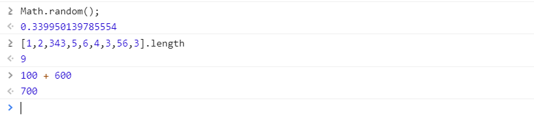

# Javascript概述

> 作者:彭劲  时间:2019-01-05

Javascript(人们通常把Javascript简称为Js)，
是一种基于对象和事件驱动的客户端脚本语言,一般运行浏览器客户端。

现今,js还可以运行在服务器端。

> 对象是指html文档中的标签元素,例如:按钮,图片,文本框等等。事件驱动是指对象触发的某种行为所产生的结果,例如:点击按钮弹出消息


Javascript诞生于1995年,它的出现主要是用于处理网页中的表单验证。
比如：验证用户名的长度,邮箱的格式等等。


## 什么是ECMAScript

ECMAScript是Javascript的组成部分,是Javascript的标准。一般来说我们认为ECMAScript和Javascript是同一个词。

> Javascript标准主要由3部分组成:ECMAScript,DOM,BOM

2009年发布的ECMAScript5.1,简称ES5,目前最成熟的版本

2015发布的ECMAScript2015,简称ES6,目前很多公司都是用ES6进行开发,但学习ES6最好有ES5作为基础

> 在区块链应用开发中我们有90%的时间在写javascript


## 开发工具和调试环境

你可以使用任何一种编辑器进行Javascript的代码编写,例如:EditPlus,SublimeText和HBuilder等。

必须在系统中安装了谷歌浏览器Chrome

本教程中使用的开发环境:vscode + Chrome


## 代码的编写方式

**内部脚本**

```html
<script type="text/javascript">
	alert("Hello World");
</script>
```

**外部脚本**

``` html
<script type="text/javascript" src="helloword.js"></script>
```

## 控制台调试方式

我们在开发中经常需要把调试结果进行输出,在谷歌,火狐或和IE高版本的浏览中有一个名为控制台的调试工具,Javascript在ES5中还提高了专门对控制台进行输出的方法

**使用console.log()进行结果输出**

```html
<script type="text/javascript">
     console.log("Hello Javascript");
     console.log("100+200=",100+200,",300+400=",300+400);
</script>
```
**在控制台中直接输出结果**



> 注意:在控制台直接输出结果在实际开发使用频率并不多,只是为了方便开发者直接查看某些结果,在浏览器中一般使用F12快捷键就能打开控制台