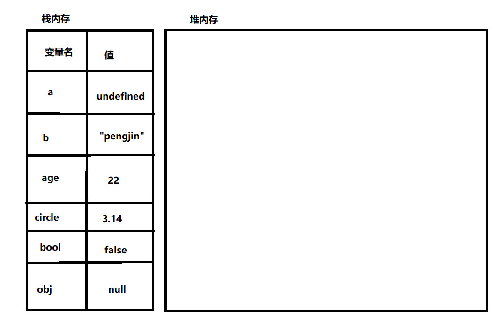
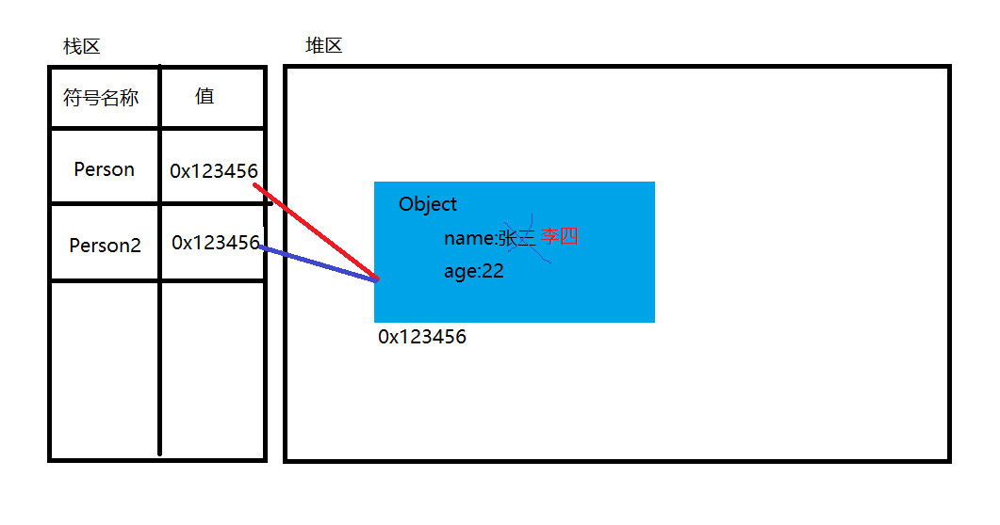
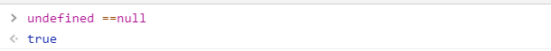
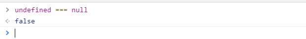
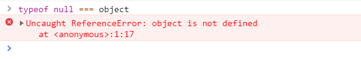
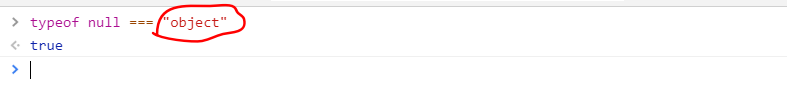
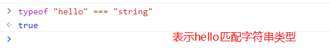

# 数据类型

> 作者:彭劲  时间:2019-01-05

**问题：为什么需要有数据类型呢？**

因为在计算机当中,计算机使用数据来描述不同性质的信息,而不同性质的信息需要使用不同的数据类型来区分。
比如:表达一个人的年龄我们使用数字类型,表达一个地址我们使用字符串类型来进行表达。

在Javascript当中有`基本数据类型（值类型）`和`引用数据类型`两大类:

## 五大基本数据类型

基本数据类型又称为值类型,一般存在于`栈内存`中,在es5当中支持以下五种基本数据类型：

**string类型（字符串）**

JavaScript的字符串类型用于表示文本数据。
文本必须以双引号或单引号包围

**number类型（数值）**

根据 ECMAScript 标准，JavaScript 中只有一种数字类型：基于 IEEE 754 标准的双精度数值。在其他编程语言中，有不同的数字类型存在，比如：整型，单精度浮点型，双精度浮点型等。但在javascript中只有Number类型，表示整数或者浮点数
Number类型中还有几个特殊的值：+Infinity，-Infinity 和 NaN (非数值，Not-a-Number)

**boolean类型（布尔）**

布尔表示一个逻辑实体，可以有两个值：true 和 false。

**null类型**

null表示一个空对象指针，如果定义的变量准备在将来用于保存对象，那么最好将该变量初始化为null而不是其他值。

**undefined类型**

undefined类型只有一个值，即undefined。未初始化的变量，都是undefined类型。

```html
<script type="text/javascript">
	var a; //undefine
	var b = "pengjin" //string
	var age = 22 //number
	var circle = 3.14 //number
	var bool = false // boolean
	var obj  = null // null
</script>
```

以上代码定义的变量都是`基本数据（值类型）`,存放在栈内存中。




# typeof操作符

typeof操作符用于返回一个变量或者字面量的类型。

```html
<script type="text/javascript">
	var a; 
	var b = "pengjin"
	var age = 22
	var circle = 3.14
	var bool = false
	var obj  = null 
	
	//undefined
	console.log("a typeof ",typof a);
	//string
	console.log("b typeof ",typof b);
	//number
	console.log("age typeof ",typof age);
	//number
	console.log("circle typeof ",typof cirlce);
	//boolean
	console.log("bool typeof ",typof bool);
	// object
	console.log("obj typeof ",typof obj);

</script>
```

**注意事项:使用typeof null发觉返回值为object,这是为什么呢?**

> 正确的返回结果应该是 "null" ，但这个 bug 由来已久，在 javascript  中已经存在了将近二十年，也许永远也不会修复，因为这牵涉到太多的 Web 系统，修复它会产生更多的 bug,会令许多系统无法正常工作。

# 引用数据类型

在Javascript中常见引用数据类型`数组`,`函数`,`Object`等类型,这些类型的值一般存放在堆内存中.

```html
<script type="text/javascript">
	var person = {
		name:"张三",
		age : 33
	}

	var person2 = person

	person2.name = "李四";

	console.log( person.name )
	console.log( person2.name )
	console.log( typeof person )
</script>
```

引用类型的变量引用的地址是一样的，一者被修改另一者也会随之发生改变,其内存图如下所示:




# null和undefined的比较运算


Javascript这个语言在诞生之处因为设计比较混乱，使得程序具有一定的bug，null和undefined使用==你会惊奇地发现它返回的结果是true,表示null和undefined的值是相等的。



>  == 只比较内容是否相等，不比较类型，===比较内容是否相等的同时也比较类型是否相等，在Javascript开发中我们尽量少使用==去比较值是否相等。

上面显然是不正确的结果,undefined和null是两种不同的基本数据类型,且作用在变量身上的表达的值和含义也不相同。

使用===比较undefined和null的结果返回正确的结果:




# typeof 类型比较运算

我们知道typeof null的返回的结果是object,这个是由javascript的bug造成的，然而你在控制台中运行: typeof null === object 会报错



造成上述的原因,是因为object被javascript认为是了一个未声明的变量而typeof null产生的object返回值是一个字符串，因此我们在使用typeof关键类型匹配时需要对希望匹配的结果使用字符串表达式，例如:”object”,”string”等等,参考代码如下所示:





