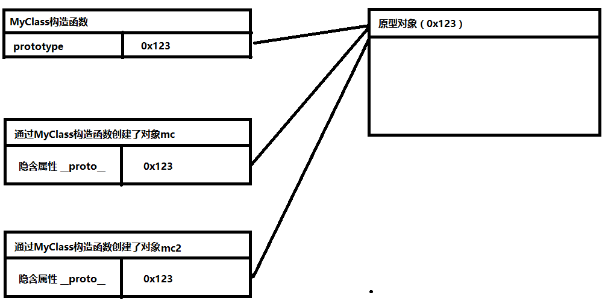

# 原型对象

我们所创建的每一个函数，解析器都会向函数中添加一个属性prototype,这个属性对应着一个对象，这个对象就是我们所谓的原型对象。

```javascript
function MyClass(){

}
//向MyClass的原型中添加属性Hello
MyClass.prototype.Hello = "hello world"


var mc = new MyClass();			
var mc2 = new MyClass();

console.log(mc.Hello)
console.log(mc2.Hello)
```

如果函数作为普通函数调用prototype没有任何作用

```javascript
//普通调用MyClass函数,无法访问原型对象中的Hello属性
var mc3 = MyClass()
console.log(mc3.Hello)
```

当函数以构造函数的形式调用时，它所创建的对象中都会有一个隐含的属性，指向该构造函数的原型对象，我们可以通过__proto__来访问该属性.

```javascript
console.log(MyClass.prototype);
console.log(mc.__proto__ == MyClass.prototype);
console.log(mc2.__proto__ == MyClass.prototype);
```

以上代码如果用画图进行理解如下所示:



当如果对象中有属性就优先查找对象中的属性,如果没有该属性就往原型对象中去查找。

```javascript
function MyClass(){
	this.hello = "我是MyClass中hello"
}
MyClass.prototype.hello = "我是原型中的hello"
MyClass.prototype.sayHello = function(){
	console.log( this.hello ); //我是MyClass中hello,因为对象中本来就有hello属性
}
var mc = new MyClass()
console.log( mc.hello )
mc.sayHello();
```

如果在对象本身没有该属性原型对象中也没有该属性,则返回undefined,如果该属性是不存在的方法则报错

```javascript
console.log( mc.speakEnglish ); //undefined
mc.getInfo(); //报错
```

如果对象中没有该属性而原型对象中含有该属性in运算符也会返回true

```javascript
console.log( "hello" in mc ); //返回true，因为对象中本来有hello
console.log( "sayHello" in mc ); //返回true,因为原型中有该属性
```

可以使用对象的hasOwnProperty()来检查对象自身中是否含有该属性,使用该方法只有当对象自身中含有属性时，才会返回true

```javascript
console.log( mc.hasOwnProperty("hello") ) //true
console.log( mc.hasOwnProperty("sayHello") ) //false 
```

#### 思考题: mc对象中并没有定义hasOwnProperty这个方法？但为什么我们可以调用hasOwnProperty()这个方法?

原型对象也是对象，所以它也有原型，当我们使用一个对象的属性或方法时，会现在自身中寻找，自身中如果有，则直接使用。如果没有则去原型对象中寻找，如果原型对象中有，则使用，如果没有则去原型的原型中寻找,直到找到Object对象的原型。

```javascript
console.log(mc.__proto__.hasOwnProperty("hasOwnProperty")); //false
console.log(mc.__proto__.__proto__.hasOwnProperty("hasOwnProperty"));//true
```


> Object对象的原型属性没有指向任何对象，如果在Object原型中依然没有找到，则返回undefined.实际上更深入了解我们需要在js高级中学习原型链

```javascript
console.log(mc.__proto__.__proto__.__proto__);//undefined
```

## 对象中的toString

当我们直接在页面中打印一个对象时，事件上是输出的对象的toString()方法的返回值，如果希望自定义对象打印时的信息就可以添加toString方法。

```javascript
function Person(name,age,gender){
	this.name = name
	this.age = age
	this.gender = gender
}

Person.prototype.toString = function(){
	return "[Person person]{name:"+ this.name + ",age:" + this.age + ",gender:" + this.gender + "}"
}

var per = new Person("zs",33,"male")

alert(per) //alert其实现在很少人用了
```

